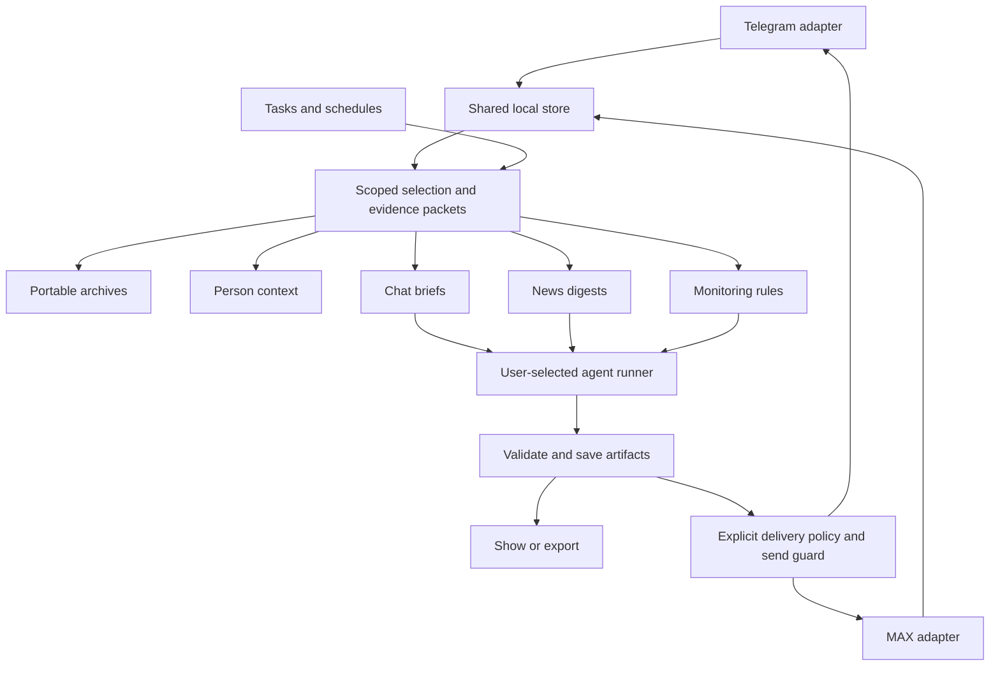

# Chat briefs, news digests, portable archives, monitoring and person context

**Status: proposal for discussion, 2026-10-02.** The owner asked to plan five capabilities before
implementing them, sharing the result between tg-cli and max-cli and making it useful to people
and agents. This document proposes the product boundaries, shared contracts and delivery order.
It does not enable a monitor, schedule, model call or send. Command examples below are proposed
interfaces, not commands available today.

## 1. What we are building

| Capability | What the user receives | First useful version |
|---|---|---|
| Chat brief | Decisions, requests, commitments, unanswered questions and next actions, with links to the conversation | A brief for selected chats and a time window, prepared for the user's agent |
| News digest | Important developments grouped by story, with sources and an explanation of relevance | Selected news feeds, topic preferences, duplicate grouping and a cited digest |
| Portable archive | Separate files for selected dialogs or groups, a baseline followed by increments, and verified recovery | Text, metadata and tombstones; attachment bytes and optional encryption follow |
| Group monitoring | Matching events, alerts and reply drafts; selected rules may send automatically | Durable rules and alerts, then templates, then agent-generated replies |
| Person context | A bounded evidence packet about a person across sources, optionally focused on their latest message | Telegram and MAX identities, relevant conversations and source links |

News and chat briefs are separate products. A news digest answers “what happened and why do I
care?” A chat brief answers “what was decided, what do I owe, and who is waiting?” They share data
selection, artifacts and scheduling, but have different schemas, prompts and preferences.

Planning assumptions pending the owner's answers: person context starts with Telegram and MAX;
monitoring starts with alerts and drafts. Both designs support explicit expansion later.

## 2. What already exists, checked against code

Local checkout snapshot; these versions are not a claim about what is published on npm:

| Repository | Inspected revision / package | Relevant reality |
|---|---|---|
| tg-cli | `f15aa62`, 0.13.0; pins cli-messaging 0.49.0 and cli-core 0.8.0 | Imports shared commands and owns the Telegram adapter; this checkout predates many shared additions |
| cli-messaging | `cec26ac`, 0.110.0 | Async shared store, services, CLI/MCP, background process utilities, search, conversations and embeddings |
| max-cli | 0.22.0; pins cli-messaging 0.108.0 and cli-core 0.15.0 | Uses shared services through `maxMessenger`; personal messages reach the shared store, but some reads still use its profile cache |

There are already tg dependency-upgrade worktrees. Integration must reconcile with that work,
rather than start a competing upgrade or edit another session's worktree. tg's `HANDOFF.md` is an
older snapshot; it is not the current feature inventory.

| Existing foundation | Evidence | What remains |
|---|---|---|
| Shared use cases for CLI and MCP | [Services](2026-09-30-services.md), `src/services/index.ts` | New use cases belong here, not in two command implementations |
| Complete database backup and restore | `src/cli/messenger/store-maintenance-command.ts`, `backupCommand` / `restoreCommand` | Portable selective archives, increment chains, attachment bytes and encryption |
| One-chat JSONL/Markdown export | `src/cli/messenger/archive-commands.ts`, `src/services/archive.ts` | Current export loads the entire chat into memory; it is not an incremental archive |
| Fetch progress, held ranges and completeness | `src/services/archive.ts`, `src/store/sqlite/completeness.ts` | Window-specific coverage and reliable acknowledgements for these workflows |
| Live ingestion and catch-up | `serve-command.ts`, `watch-command.ts`, `stored.ts` | Durable consumers: `watch` calls its listener before its asynchronous store save finishes |
| Search across accounts and messengers | `src/services/messages.ts`, `scopeOf` / `searchStore` | A bounded context packet and a confirmed cross-messenger person |
| Identities, persons and initial links | `src/store/sqlite/identities.ts`, `identityOf`; `schema.ts` | Every identity initially gets its own person; no public merge/unlink API is present in `MessageStore` |
| Local conversation and semantic enrichment | [Storage architecture](../dev/ARCHITECTURE.md#the-store) | Reuse when available, while ordinary context works without enrichment |
| Group rules and guarded moderation | `src/services/moderation.ts` | Monitoring and reply policies; moderation does not itself provide an autoreply service |

The existing [platform proposal](2026-09-26-platform-proposal.md#8-phases--small-independently-shippable-pull-requests)
is the roadmap entry point. This proposal extends its previously excluded summarisation scope;
it does not silently mark that scope approved or complete.

## 3. The shared boundary

Keep messenger-neutral functionality in `@leemour/cli-messaging`. tg-cli and max-cli provide the
account connection, provider capabilities, downloads and guarded delivery. Do not add a database
owner daemon: the [existing ruling](../storage/daemon.md) allows background workers opening the
same SQLite store, while commands and MCP keep their direct access.



Use four small shared building blocks, without a general workflow engine:

1. **Source collections and scope.** A saved list of provider/account/chat references, a purpose
   such as news or chats, and optional topic filters. A group may be a news source; a channel is
   not automatically news. Cross-account reads are explicit and pass the existing read gates.
2. **Evidence packets and artifacts.** Immutable prepared input, validated agent output, source
   references, rendering preferences and result status. Artifacts carry content; diagnostic run
   records continue to carry ids and counts only.
3. **Progress and change cursors.** Durable consumption of committed local changes, a cursor per
   consumer and selected scope, and per-chat coverage. A backup, news feed and monitor never share
   an acknowledgement merely because they read the same messages.
4. **Tasks.** A typed operation, input scope, optional schedule, runner, output destination and
   delivery policy. Reuse the background lock/unit/process utilities and fetch-lease patterns.
   Existing `store jobs` remains the history-fetch job interface.

Expose use cases through `./services`; CLI and MCP call the same methods. Start inside the current
package. Extract another package only if an actual non-messaging consumer needs the runner.

## 4. The agent contract

Separate deterministic preparation from language-model judgement. The initial implementation
does not embed an LLM client for briefs, news ranking or replies. It produces a packet the user's
agent can process, as conversation linking already does under the
[agent-driven enrichment ruling](../storage/decisions.md#ruled). Applying that approach to these new
features is a recommendation, not an already approved extension of that ruling.

An evidence packet contains:

- A schema version, opaque packet id, operation kind and input fingerprint.
- Explicit accounts, chats, selected time window and the fixed ingestion cutoff.
- Message locators, content fingerprints, timestamps and bounded reply/conversation context.
- Coverage for every selected source, omissions, truncation and freshness at collection time.
- User preferences and the expected structured result, separated from quoted source content.

An answer references the packet id and fingerprint. Each factual item names supporting locators;
inference, suggested action and source-reported claims are labelled separately. Validation checks
the schema, packet scope, locator membership and source versions; it cannot prove a model's prose
is faithful, so review of summary quality remains necessary. A changed anchor makes a reply draft
stale; a digest may retain its historical snapshot with an explicit revision notice.

The interactive path is: prepare packet → agent supplies structured answer → validate/save →
show/export → explicitly send. A scheduled run needs a registered agent runner; installing a CLI
or MCP server does not create one. Without a runner, preparation still works and the task reports
that it is waiting for an agent. A runner consumes a packet and returns a schema-bound result,
with a timeout, cancellation and output-size limit. Execution uses a user-configured executable
and argv; source messages never become shell commands or grants of sending permission.

Ship a shared workflow skill and prompt templates, with thin tg/max instructions and the same
packet schemas. No agent has to rediscover pagination, cursor rules, identity ambiguity or send
retries in every run.

## 5. Two distinct digest workflows

### Chat briefs

Select dialogs/groups explicitly; reuse `inbox`, `review`, search and conversation context, but
do not treat unread count as a durable digest cursor. The brief schema has decisions, requests,
commitments, unanswered questions, next actions and references. Dates and assignees may be unknown;
an agent does not invent them. An extraction heuristic is only a candidate for agent review.

Store the brief independently of read receipts. Preparing or showing it marks no chat read.
If one chat cannot be collected, the brief names it and that chat's progress does not advance.
Completion in the store today is history-wide; add requested-window coverage so a daily brief need
not wait for the beginning of a ten-year dialog.

### News collection and control

The user defines feeds, topics, exclusions and preferred importance criteria. Begin with messages
already imported from Telegram/MAX. RSS, web fetching and other connectors are later source
adapters, not part of messenger adapters or an implicit network crawl.

The pipeline is: collect → group duplicate candidates → rank → select → render. Start with
normalised URLs, exact content hashes and forwarded-source references for cheap duplicate
candidates. Do not strip arbitrary URL parameters: use conservative, versioned rules for known
tracking parameters. Semantic story grouping and importance are agent decisions, with original
posts retained as evidence. Publication and observation time are separate where known; a forward
does not make an old event new.

A news item has the development, why it matters to these preferences, event/publication time when
known, source references and uncertainty. Copies of one claim do not count as independent
confirmation. The user can include/exclude a story or correct its importance; those decisions are
saved as preferences for future runs. A quiet period can produce “no important news” rather than
fill a quota. Updates to a previously reported story link to it instead of repeating it as new.

Keep three preferences independent: **detail** (brief/normal/detailed), **representation**
(JSON/Markdown/plain text/HTML) and **destination** (local artifact/file/explicit recipient).
Render from one structured result; do not ask a model to regenerate facts for each format. Start
with text formats; audio and rich newsletters can be added after the core works.

## 6. Archives: export, full backup and increments

These have different recovery contracts:

| Operation | Contract |
|---|---|
| Transcript export | A readable or machine-readable selected chat from the local copy; no recovery promise |
| Full store backup | The existing consistent database copy; store-wide and includes every stored account |
| Portable archive | A versioned, selected-scope baseline plus deltas, verifiable and importable independently of SQLite schema |

An archive contains what was observed locally. Completeness and failed downloads appear in its
manifest; it does not promise Telegram/MAX will make already deleted or unseen messages available.
Restoring imports local records, never resends conversations into a messenger.

The user flow is: choose one dialog/group or an explicit set such as all dialogs → show the local
coverage and fetch estimate → optionally fetch missing history → write the archive → verify it.
Fetching is a separate visible operation, with provider rate limits, pause/resume and per-chat
failure. A store-only backup never silently scans the remote account. Providers with pushed
history expose their available coverage instead of pretending they support Telegram's backfill.

### Files and recovery

Use opaque source/chat keys in paths and keep human titles inside metadata. Suggested layout:

```text
archive/
  manifest.json
  snapshots/<snapshot-id>/manifest.json
  snapshots/<snapshot-id>/chats/<chat-key>/chat.json
  snapshots/<snapshot-id>/chats/<chat-key>/messages-000001.jsonl
  increments/<increment-id>/manifest.json
  increments/<increment-id>/chats/<chat-key>/changes-000001.jsonl
  blobs/<sha256>
```

Manifests name the archive id, format version, source-store generation, exact scope, parent,
cursor interval, checksums and per-source coverage. Records use portable provider/account/chat/
message keys, never another database's numeric primary keys. Preserve replies, threads, forwards,
author identities, available edit history, deletion state and attachment metadata. Do not restore
source-store person primary keys or infer cross-messenger merges from matching names.

Write bounded shards into staging, flush and verify them, and publish the manifest last. A crash
cannot advertise a half-written increment as complete. Advance the archive cursor only after the
manifest and files are durable. Import verifies format, parent chain, scope and checksums before
application; record lineage/progress makes a retry idempotent and an interrupted import resumable.
Import into a new local store is the first recovery path; merging into an existing store needs an
explicit conflict policy and a preview. Full `store restore` remains a separate operation.

### A correct increment

`--since-time` in today's export filters send time. It misses old-message edits, reaction changes,
late imports and deletions. Add a monotonically ordered **committed change journal**, written in
the same store transaction as each relevant mutation. It carries keys, kind and sequence, without
duplicating message bodies. Re-reading an unchanged message should not emit another content event.
Distinguish live message arrival from backfill and local enrichment so a history import does not
trigger a flood of replies.

An increment covers `(previousCursor, cutoff]`. Read the journal and the corresponding current
records from the **same database snapshot**; coalesce repeated mutations into the final state at
that cutoff. Include explicit tombstones and scope-removal events. This is recovery of observed
state, not a promise to retain every intermediate version of a message. Existing deletion policy
clears message text and revisions; the journal must preserve that policy.

Snapshot construction is a required spike before implementation: compare a dedicated read-only
snapshot connection against a temporary consistent database copy. Measure long-reader WAL growth,
disk cost and responsiveness at 1M messages. Do not keep a transaction open on the ordinary store
connection across file/network awaits or add a general `transaction(callback)` to `MessageStore`.
The archive exporter needs an explicit snapshot seam with ownership, close/cancel and limits.
[SQLite documents snapshot isolation](https://www.sqlite.org/isolation.html); existing full backup
uses [VACUUM INTO](https://www.sqlite.org/lang_vacuum.html), which yields a consistent copy but an
interrupted output can be incomplete. A full copy per small increment may be too expensive.

Journal coverage must include direct writes, pushed deltas, transcript/attachment changes, person
facts, and explicit account/chat purges. Index rebuilds are not content changes. Reserve additive
migration numbers only at implementation, following the lanes plan. A store restore/fork changes
its lineage; cursors from the previous generation cannot silently continue. If journal retention
passes a consumer's cursor, return “new baseline required”. No automatic destructive retention is
part of the first release.

Old archive files can still contain content later deleted at the source. Import applies the later
tombstone, but immutable earlier files are not retroactively rewritten. Explain this contract in
the user documentation; sanitising older archives would be a separate explicit operation.

### Attachments and optional encryption

Metadata-only is the first archive mode. Add locally available bytes next, then explicit download
of missing bytes through the provider adapter, with size/rate limits and per-file errors. Store
bytes by content hash and verify before publishing; an expiring URL alone is not a backed-up file.
Exclude sessions, credentials and protocol authentication material, including secrets in provider
metadata. Build the format from an allow-list, not an unrestricted dump of provider objects.

For optional encryption, prefer [age](https://github.com/FiloSottile/age) via an injected executable
boundary. It supports recipient keys and interactive passphrases. Unattended backups can encrypt
to a public recipient without having the private decryption key. Never implement custom crypto.
Encrypt manifests, chat metadata, message shards and blobs; clear filenames use opaque identifiers.
Stream through encryption into staging so enabling encryption does not first create persistent
plaintext exports. Report the dependency if unavailable; never silently fall back to plaintext.
Key recovery and an actual decrypt/import round trip are part of acceptance, not just encryption.

## 7. Monitoring and replies

A monitor names exact accounts/groups, event kinds, conditions, context limits and an action.
Initial conditions: words/phrases, mentions/replies to the owner, links from selected domains,
new questions and unanswered candidates. Agent classification is optional per rule. Actions:
record a finding, notify an explicit destination, create a draft or send under an enabled policy.

Consume the committed journal, not `watch --jsonl` as a durable queue. `serve` is the ingester;
monitor workers read the shared store and need no second subscription for the same account.
If persistence fails, report degraded ingestion and do not acknowledge or act on an uncommitted
event. Backfill, outgoing messages, bot/automation output, edits and restart catch-up are treated
according to the rule, with a freshness deadline for replies. Alerting on edits is useful; sending
another reply on every edit is not the default.

Progression: alerts → drafts → automatic template replies → agent replies. Automated delivery is
enabled per rule and recipient scope, with cooldowns, hourly limits, own-message/loop suppression,
quiet hours and an immediate stop/disable control. Existing recipient permissions and send guards
still apply. A rule cannot grant permission that the account lacks. Headless `ask` permissions
produce a pending draft; they never hang a scheduler waiting for a terminal.

Save a proposed reply in a durable outbox before sending, keyed by rule version, source event and
destination. Check the current source fingerprint and deadline again before delivery. Retries
reuse a persisted send id only where the provider supports deduplication. `outcome_unknown`
remains uncertain and requires reconciliation; bot sends do not support safe blind retries.
Promise durable processing and bounded duplicate prevention, not universal exactly-once delivery.
Group moderation can reuse rule storage patterns but remains a distinct action from replying.

## 8. Person context, including the latest message

Separate identity resolution, evidence retrieval and narrative synthesis:

1. Resolve a person to a stable uid and confirmed provider identities. Introduce audited manual
   link/unlink operations over existing person/link tables. Names and similar usernames produce
   candidates only. Keep the original identities and message authorship when links change.
2. Collect bounded evidence from the selected accounts: direct dialogs, the person's group posts,
   explicit replies and relevant conversations. Name mentions alone are lower-confidence evidence.
   Use local lexical search first; optional enriched conversations and semantic search supplement it.
3. For an anchor message, retrieve its reply chain, conversation neighbours and earlier related
   discussions. “Latest” means latest **observed in the selected scope**, with its freshness shown,
   not a claim that all remote sources have been checked.
4. Return a packet with facts, interactions, commitments, unresolved questions, relevance reasons,
   sources and gaps. The agent can then produce a brief or a draft response separately.

Apply per-source and total budgets, deterministic paging and a continuation cursor. A frequent
author must not fill the packet with one group. Date bounds and an anchor fingerprint make the
result reproducible. Unknown identity, ambiguous match and missing coverage are distinguishable;
zero results are not a claim that the person never discussed a topic.

First sources are the local Telegram/MAX archive. Define a small later `ContextSource` contract:
resolve identity candidates, search a bounded scope, fetch an evidence item, and report provenance/
freshness/coverage. Email, documents and CRM connectors retain their own permissions and explicit
identity mappings. Do not turn message search into an unbounded crawl of every connected account.

## 9. Schedules and interfaces

A task separates **what**, **when**, **who computes**, **where the artifact goes** and **whether to
deliver it**. Reuse one task contract for archive creation, digests and periodic monitoring checks;
continuous monitors use an explicit background worker. Do not overload provider-native scheduled
messages: the digest's content is computed at run time, and a powered-off machine cannot compute it.

Start with an explicit one-shot task command and external scheduling, then add common schedule
management over systemd user timers / launchd and an injected scheduler seam. A foreground runner
or an external scheduler remains a fallback on other platforms. The CLI does not auto-start a
worker or install a timer when a person only asks for a brief.

Schedules store an IANA timezone and wall-clock time. Specify DST and downtime policy: run once
after a missed digest window, combining pending data; expired replies are skipped. Pin account/
profile/store path and runner configuration at task creation, rather than inherit whichever
profile happens to be the next process's default. A lease plus a fencing token prevents overlap;
resumed workers cannot publish after losing ownership. All tasks expose next run, last result,
progress, failure and how to stop them.

Prepare a fixed input window, persist its artifact, and track collection and delivery separately.
Per-source checkpoints advance only when that source's included data has a durable disposition;
truncated or failed sources keep their pending interval. A stored digest is not discarded because
delivery failed. Delivery retries use the saved artifact, never regenerate an altered digest.

Possible CLI surface, to review against [STANDARD.md](../dev/STANDARD.md#command-names) before
changing the standard or parity manifest:

```sh
tg digests create --kind chats --collection work --since-time 1d
max digests create --kind news --collection industry --since-time 1d
tg digests show <digest>
tg digests update <digest> --file answer.json
tg digests export <digest> --format markdown --output digest.md
tg digests send <digest> <chat>
tg contacts context <person> --source all
max contacts context <person> --about <message-locator>
tg store export <chat> --format markdown --output dialog.md
tg store backup snapshot.db
tg monitors create --file rule.json
tg tasks create --file task.json
tg tasks start <task>
tg tasks stop <task>
```

`collections`, `digests`, `monitors` and `tasks` are draft resource names. Archive modes should
extend `store backup`/`store export` without changing existing positional meanings; exact options
and the portable-import interface need the contract PR. Creation never starts automation. Schedule
installation, worker start and automatic delivery have separate, visible effects.

People get a short setup flow, useful terminal output, readable files, presets and a preview of
scope/destination. Agents get one JSON result, typed errors, cursors and bounded packets; streaming
remains explicit JSONL. MCP exposes narrow tools matching the commands, separating preparation,
local writes and remote sends. Add command, MCP tool, skill guidance, docs and parity registration
in the same feature PR.

The existing proposal includes a future read-only `msg` executable. These services should support
it, but adding a third CLI is not a prerequisite. tg and max can first expose the same scoped
reads; any later `msg` keeps its read-only boundary and does not secretly route sends.

## 10. Delivery plan

These are dependency-ordered work packages, not calendar commitments. Most packages need several
small PRs. Estimate dates after the archive/runner spikes and the consumer-upgrade inventory.

| Order | Package | Depends on | Reviewable result and acceptance |
|---|---|---|---|
| 0 | Integration inventory and focused spikes | None | Agree consumer versions/capabilities, source-scope permissions, archive snapshot strategy, runner availability and first naming contracts |
| 1a | Evidence packets and source collections | 0 | Identical bounded selection from tg/max and CLI/MCP, per-source coverage, stable fingerprints, no implicit enrichment or sends |
| 1b | Committed mutation journal | 0 | Transactional keys/cursors, origin distinction, actual-change detection, purge and restore lineage; shared by archives, tasks and monitors |
| 2 | Separate chat/news workflows, on demand | 1a | Distinct cited schemas and skills, agent answer validation, saved artifact, detail/format selection; evaluate with the owner on selected examples |
| 3 | Person context in Telegram/MAX | 1a | Audited link/unlink, ambiguous names refused, anchor context and budgets; ordinary search works without vectors |
| 4a | Streamed selective exports and portable baseline | 0 | Bounded memory, separate chat files, manifest validation and recovery into a new isolated store |
| 4b | Incremental recovery | 1b, 4a | Snapshot cutoff, edits/deletions/late imports/purges, lineage handling, replay after crashes |
| 4c | Attachment bytes and optional age encryption | 4b | Hash-verified files, missing bytes reported, no plaintext fallback, decrypt/import round trip |
| 5 | Typed tasks and scheduled news delivery | 1b, 2 | Runner adapter, manual task execution, persisted windows/outbox, timezone/downtime policy; timer management follows |
| 6a | Durable monitors, alerts and drafts | 1a, 1b, 5 | Restart recovery without losing acknowledged events, origin filtering, explicit rule/destination policies and stop control |
| 6b | Automatic replies | 3, 6a | Templates first; guarded outbox, stale-source checks, cooldown/loop limits and unknown-send reconciliation; then agent replies |
| 7 | Additional context/news sources | 2, 3 | One real source adapter proving bounded retrieval, permissions and provenance before generalising further |

Packages 2, 3 and 4a can be developed independently after their foundations; this is a dependency
property, not an instruction to start parallel agents. The first demonstration can use existing
full backup plus selected-chat export while portable increment work continues.
Scheduling and monitors do not have to wait for attachment backups or encryption: they depend on
the shared journal, not on the portable archive implementation.

For shared migrations, use additive schema changes, announce the next free numbers and measure
cross-version opening/refusal. Release through the existing cadence and update each consumer under
its own rules; do not edit max-cli from this session. A shared feature is not complete merely
because cli-messaging exports it: both consumers need capabilities, docs and MCP integration.

## 11. Verification that matters

- **Archive recovery:** baseline plus several increments equals the expected selected state in a
  fresh store. Include concurrent updates, an old edit, deletion, late history, attachment change,
  purge, broken parent/checksum, journal gap, store restore/fork and an interrupted export/import.
- **Delivery failure:** crash before send, after send before acknowledgement, expired lease and
  unknown outcome. Restart neither loses work nor blindly repeats an uncertain bot send.
- **Coverage:** busy/truncated and failed chats keep their progress; idle chats acknowledge a
  proven empty window. Source timestamps alone never determine ingestion progress.
- **Digest quality:** owner-reviewed examples for important-story recall, duplicate grouping,
  unsupported claims, citation usefulness and chat action extraction. Schema tests do not prove
  that an agent selected good news. Save approved synthetic/redacted evaluation examples.
- **Context:** identical names across messengers, incorrect link then unlink, changed anchor,
  person authoring many group posts, incomplete archive and absent enrichment.
- **Scheduling:** DST boundaries, machine downtime, overlap, cancellation and runner unavailable.
- **Scale:** 1M-message group plus other active accounts; bounded memory, WAL growth and other
  commands remaining responsive. Record measurements before adopting sharding/page defaults.
- **Contracts:** shared service behavior agrees across CLI/MCP, stdout remains data, errors are
  typed, artifacts contain no session material, diagnostics contain no message text.

Tests use temporary stores, fake clocks and adapters. Live evaluation is read-only by default;
any delivery test follows each project's existing account and send rules.

## 12. Decisions to discuss before implementation

| Decision | Recommendation | Why it affects the plan |
|---|---|---|
| First context sources | Telegram + MAX first | Gives a complete shared use case without requiring mail/document connectors immediately |
| Initial monitor mode | Alerts and drafts; auto-send per enabled rule | Establishes event quality before delivering replies without review |
| Where language judgement runs | User's agent, through a packet/runner contract | Reuses the existing agent workflow and avoids two model clients in messenger CLIs |
| First news inputs | Explicit Telegram/MAX feed collections | RSS/web can use a separate source seam without delaying the first digest |
| Archive semantics | Current observed state plus available revisions; baseline/deltas | Fits current deletion policy; preserving every historical version would be a different product |
| Encryption | Optional age recipient-key mode after recovery works | Public-key backup needs no private decryption key on the scheduled writer |
| Scheduler | One-shot tasks first, OS/external scheduling second | Works with the user's chosen agent runner and existing background utilities |
| Command groups and archive options | Review in a contract PR before code | Keeps tg/max names, help, permissions and MCP consistent |

The next concrete step is package 0: a small implementation-ready contract and the snapshot/runner
spikes. No active subscriptions, timers or autoreplies are required to review this proposal.
